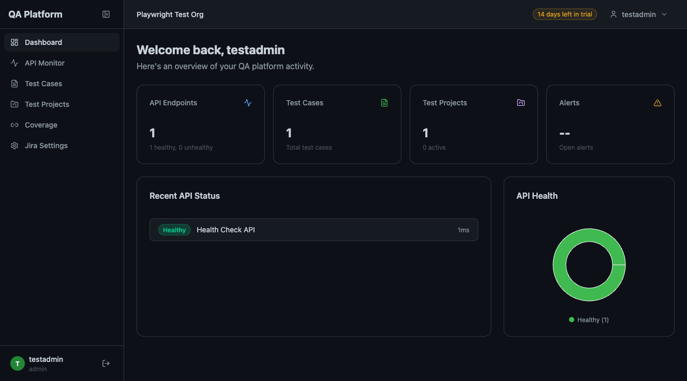
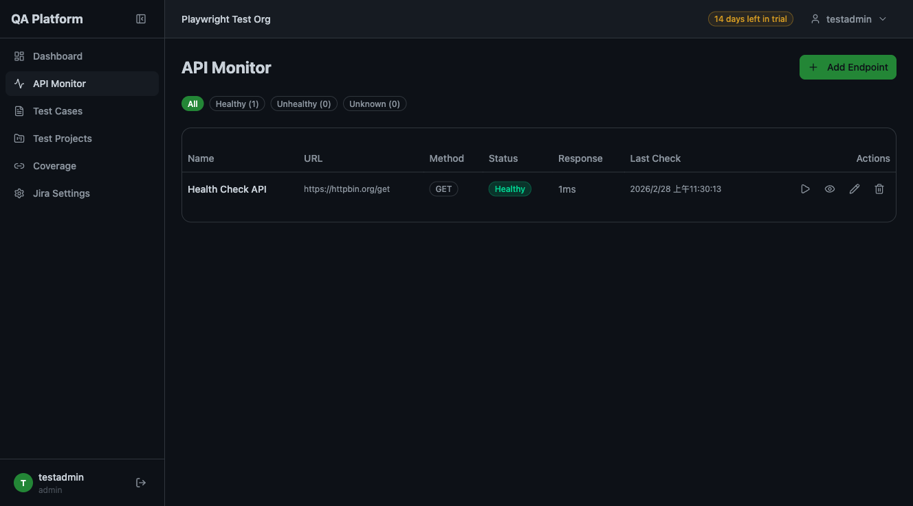
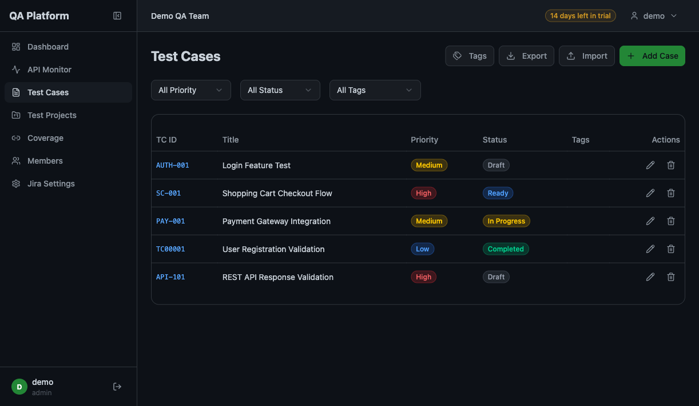
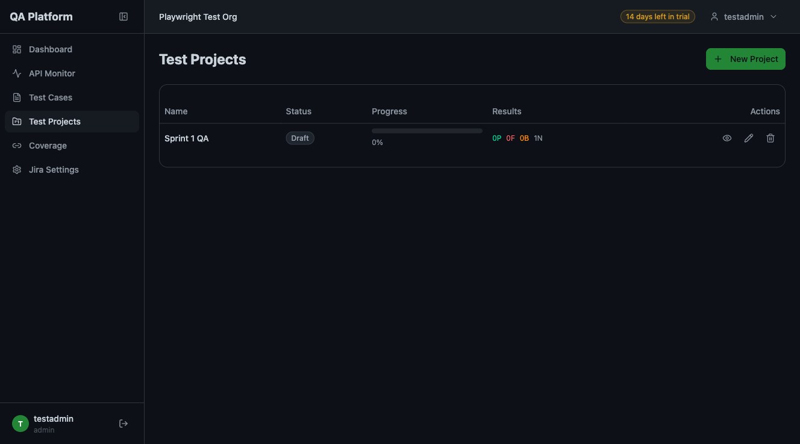
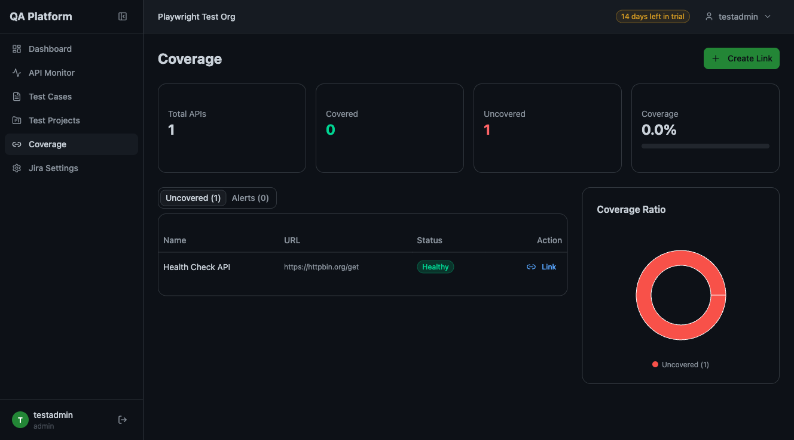
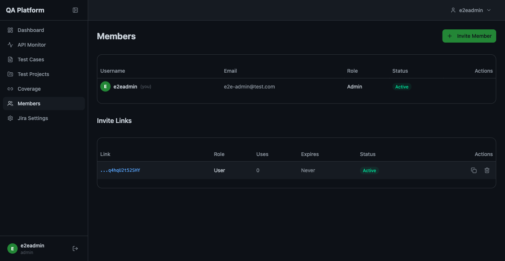
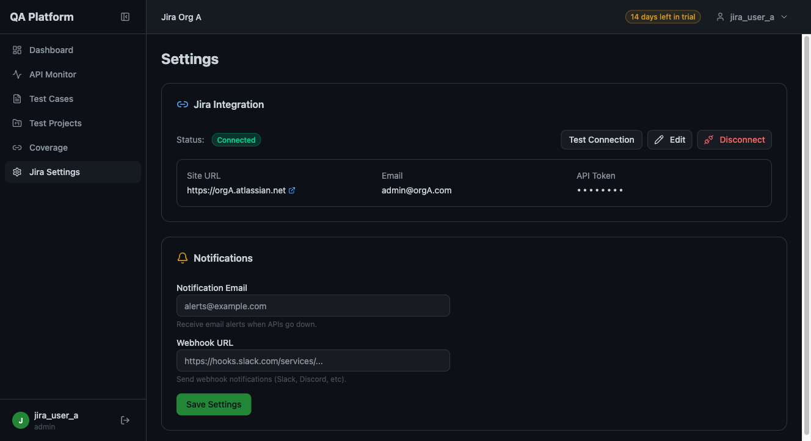

# QA Management Platform

> A multi-tenant QA management platform for teams.
> 為 QA 團隊打造的多租戶品質管理平台。

Manage test cases, track test projects, monitor API health, analyze coverage, invite team members, and integrate with Jira — all in one place.

集中管理測試案例、追蹤測試專案、監控 API 健康狀態、分析覆蓋率、邀請團隊成員、串接 Jira — 一站式搞定。

---

## Screenshots 截圖

### Dashboard 儀表板

Overview of your QA activity at a glance — API health, test cases, project progress, and alerts.

一眼掌握 QA 整體狀態：API 健康度、測試案例數、專案進度、告警通知。



### API Monitor API 監控

Add API endpoints, run health checks on demand, track response time and uptime history.

新增 API 端點、隨時執行健康檢查、追蹤回應時間與上線率。



### Test Cases 測試案例

Create and manage test cases with customizable TC IDs (e.g. AUTH-001, SC-001, PAY-001) or auto-generated sequential IDs. Filter by priority/status/tags, bulk import/export via CSV.

建立與管理測試案例，支援自定義編號（如 AUTH-001、SC-001、PAY-001）或自動生成流水號。依優先級/狀態/標籤篩選，支援 CSV 批量匯入匯出。



### Test Projects 測試專案

Organize test cases into projects, assign cases to team members, track pass/fail/blocked results per case.

將測試案例組織成專案，指派給團隊成員，逐案追蹤通過/失敗/阻塞結果。



### Coverage 覆蓋率分析

See which APIs have linked test cases and which don't. Spot coverage gaps and create links.

一目瞭然哪些 API 有對應的測試案例、哪些沒有，快速發現覆蓋缺口並建立關聯。



### Members 成員管理

Invite team members via shareable links, manage roles (admin/user), deactivate accounts.

透過分享連結邀請成員加入組織，管理角色權限（admin/user），停用帳號。



### Jira Integration Jira 串接

Connect your Jira instance with API Token, create issues from test results with customizable bug templates, sync status bidirectionally.

使用 API Token 連接 Jira，從測試結果建立 Issue（支援自定義 Bug 模板），雙向同步狀態。



---

## Features 功能

| Feature 功能 | Description 說明 |
|---|---|
| **Test Case Management 測試案例管理** | CRUD with customizable TC IDs (e.g. AUTH-001, SC-001) or auto-generated sequential IDs, priority/status filters, CSV import/export, product tags 支援自定義編號或自動流水號的完整 CRUD，優先級/狀態篩選，CSV 匯入匯出，產品標籤 |
| **Test Project Tracking 測試專案追蹤** | Project lifecycle (draft → in progress → completed), case assignment, per-case results, assignee per case 專案生命週期管理，案例分配，逐案結果追蹤，指派測試人員 |
| **API Health Monitoring API 健康監控** | Scheduled checks, response time tracking, uptime %, on-demand Check Now 定時檢查，回應時間追蹤，上線率，即時手動檢查 |
| **Coverage Analysis 覆蓋率分析** | API-to-test-case linking, uncovered API detection, coverage alerts API 與測試案例關聯，未覆蓋 API 偵測，覆蓋率告警 |
| **Member Invitation 成員邀請** | Admin creates invite links, new members join via URL, role management 管理員建立邀請連結，新成員透過 URL 加入，角色管理 |
| **Jira Integration Jira 串接** | API Token auth, issue creation from test results with customizable bug templates, bidirectional sync API Token 認證，從測試結果建立 Issue（支援自定義 Bug 模板），雙向同步 |
| **Multi-Tenant 多租戶** | Organization isolation, 14-day free trial, JWT authentication 組織隔離，14 天免費試用，JWT 認證 |

---

## Tech Stack 技術架構

| Layer 層級 | Technology 技術 |
|---|---|
| Backend 後端 | Python, Flask 3.1, SQLAlchemy 2.0, PostgreSQL, Alembic |
| Frontend 前端 | React 19, TypeScript, Vite 7, TanStack Query, shadcn/ui, Tailwind CSS 4, Recharts |
| Auth 認證 | JWT (access + refresh tokens), bcrypt |

---

## Quick Start 快速開始

### Prerequisites 前置需求

- **Python 3.10+** — [Download 下載](https://www.python.org/downloads/)
- **Node.js 20+** — [Download 下載](https://nodejs.org/)
- **PostgreSQL** — [Download 下載](https://www.postgresql.org/download/) (or use SQLite for local dev 或本地開發用 SQLite)

### Step 1: Clone the repo 複製專案

```bash
git clone https://github.com/RitaQQ/QA-Management-Platform.git
cd QA-Management-Platform
```

### Step 2: Start the backend 啟動後端

```bash
cd backend

# Create virtual environment 建立虛擬環境
python3 -m venv venv
source venv/bin/activate        # macOS / Linux
# venv\Scripts\activate         # Windows

# Install dependencies 安裝依賴
pip install -r requirements.txt

# Create .env file 建立環境設定檔
cat > .env << 'EOF'
SECRET_KEY=change-me-to-a-random-string
DATABASE_URL=sqlite:///data/qa.db
EOF

# Apply database migrations 套用資料庫遷移
alembic upgrade head

# Start API server 啟動 API 伺服器 (port 5001)
flask --app app_factory:create_app run --port 5001
```

Backend is now running at 後端已在運行: `http://localhost:5001`

### Step 3: Start the frontend 啟動前端

Open a new terminal 開啟新的終端視窗:

```bash
cd frontend

# Install dependencies 安裝依賴
npm install

# Start dev server 啟動開發伺服器
npm run dev
```

Frontend is now running at 前端已在運行: `http://localhost:5173`

### Step 4: Create your account 建立帳號

1. Open 開啟 `http://localhost:5173`
2. Click "Create one" to register 點擊 "Create one" 註冊
3. Fill in: Organization name, Username, Email, Password 填寫：組織名稱、使用者名稱、Email、密碼
4. You're in! You'll be redirected to the dashboard. 完成！自動跳轉至儀表板。

---

## Project Structure 專案結構

```
QA-Management-Platform/
├── backend/                    # Flask REST API
│   ├── app_factory.py          # App factory (creates Flask app, registers blueprints)
│   ├── config.py               # Environment-based configuration
│   ├── database/
│   │   ├── models.py           # 13 SQLAlchemy ORM models
│   │   ├── session.py          # DB engine + session factory
│   │   └── migrations/         # Alembic version-controlled migrations
│   ├── middleware/
│   │   ├── auth.py             # JWT creation, @jwt_required, @admin_required
│   │   └── tenant.py           # Multi-tenant isolation via g.tenant_id
│   ├── routes/                 # One Blueprint per feature
│   ├── services/               # Business logic layer
│   ├── tests/                  # Pytest test suite (12 test files)
│   └── requirements.txt
│
├── frontend/                   # React SPA
│   ├── src/
│   │   ├── pages/              # 10 page components
│   │   ├── components/         # Shared + shadcn/ui components
│   │   ├── contexts/           # AuthProvider (JWT state management)
│   │   ├── services/api.ts     # Axios instance with token refresh
│   │   └── types/index.ts      # TypeScript interfaces
│   ├── package.json
│   └── vite.config.ts
│
├── docs/screenshots/           # README screenshots
├── CLAUDE.md                   # Developer guide for Claude Code
└── README.md
```

---

## API Endpoints API 端點

| Area 功能區 | Prefix 前綴 | Auth 認證 |
|---|---|---|
| Auth 認證 | `/api/auth/*` | Public 公開 (register, login, join) |
| Members 成員 | `/api/members/*` | JWT; admin for invite links 管理員才能管理邀請連結 |
| APIs | `/api/apis/*` | JWT |
| Test Cases 測試案例 | `/api/test-cases/*` | JWT |
| Test Projects 測試專案 | `/api/test-projects/*` | JWT |
| Coverage 覆蓋率 | `/api/coverage/*` | JWT |
| Jira | `/api/jira/*` | JWT |
| Product Tags 產品標籤 | `/api/product-tags/*` | JWT |
| Notifications 通知 | `/api/notifications/*` | JWT |
| Reports 報告 | `/api/reports/*` | JWT |

---

## Development 開發

### Run tests 執行測試

```bash
cd backend
source venv/bin/activate
python -m pytest tests/ -v
```

### Frontend type check + build 前端類型檢查 + 建置

```bash
cd frontend
npx tsc --noEmit     # Type check 類型檢查
npm run build        # Production build 正式建置
```

### Database migrations 資料庫遷移

```bash
cd backend
source venv/bin/activate

# Apply all migrations 套用所有遷移
alembic upgrade head

# Create new migration 建立新遷移
alembic revision --autogenerate -m "description"
```

---

## License 授權

MIT — see [LICENSE](LICENSE)
